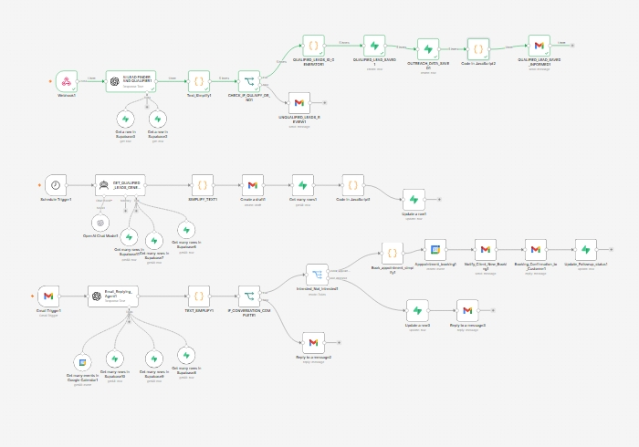
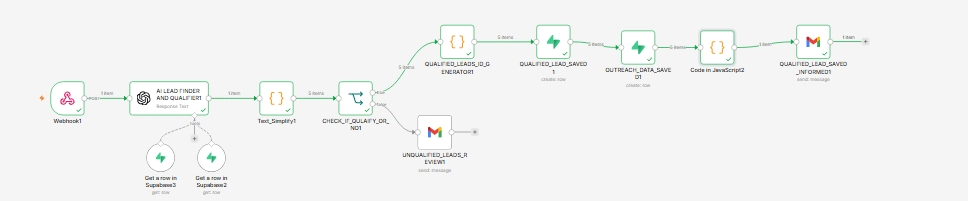
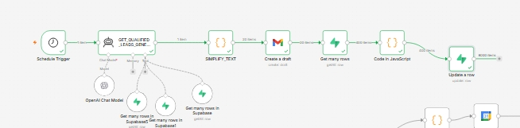
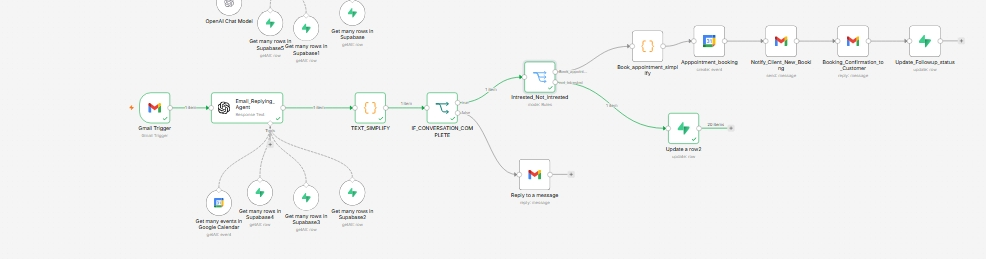
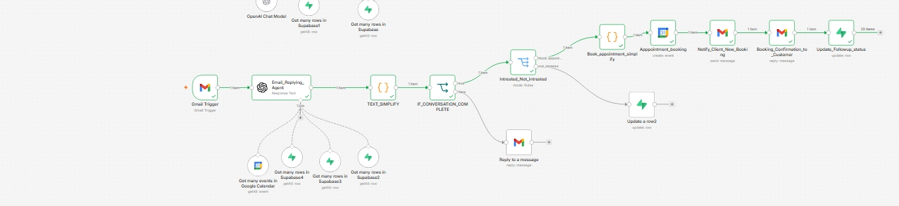
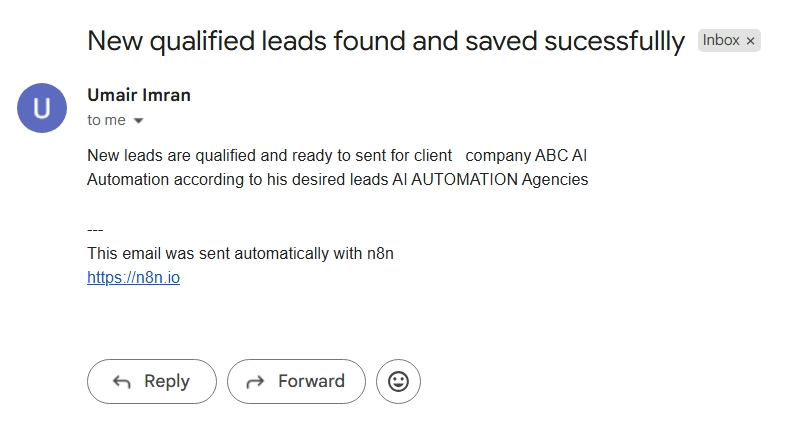
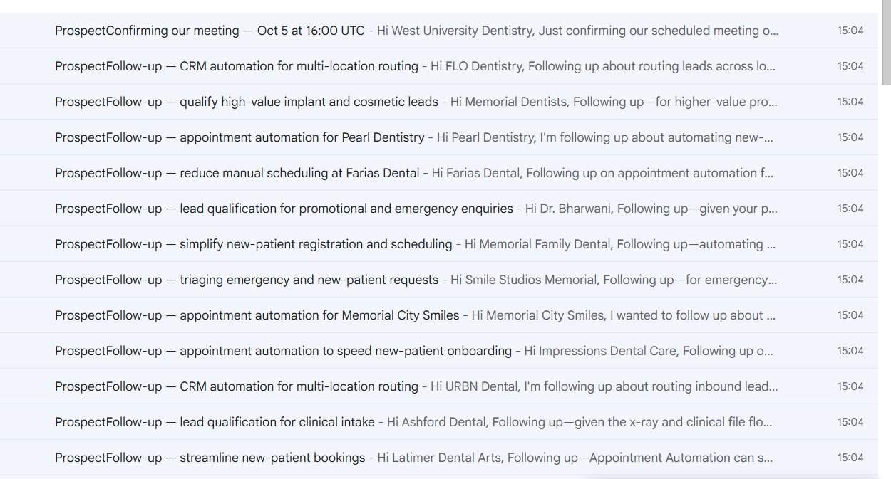
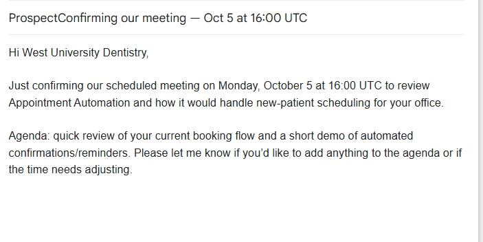
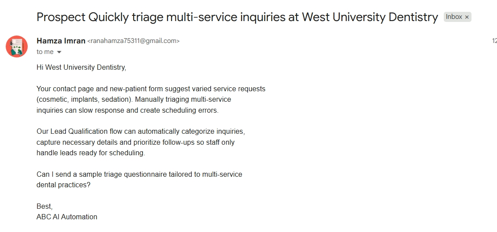
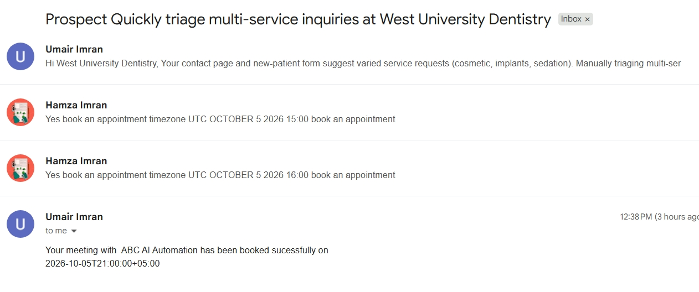

# ProspectEngine-AI-Autonomous-B2B-Prospecting-Outreach-Appointment-Automation
ProspectEngine AI is an end-to-end AI-powered B2B sales automation system built with n8n, OpenAI, Supabase, Gmail, and Google Calendar.
The system addresses a common business problem: outbound sales requires significant manual work across prospect research, qualification, personalized outreach, follow-ups, reply handling, and appointment scheduling.

Instead of generating simple lead lists, ProspectEngine AI connects these processes into one automated pipeline.

The Problem

Traditional outbound prospecting often requires sales teams to manually:

Search for potential businesses
Research each company
Determine whether the company matches the ideal customer profile
Find reliable public contact information
Identify potential business problems or opportunities
Write personalized outreach
Track previous messages
Schedule follow-ups
Handle incoming replies
Determine prospect intent
Coordinate meetings

This creates a fragmented and time-consuming sales process and increases the risk of duplicate outreach, missed follow-ups, generic messaging, and inconsistent prospect management.

The Solution

ProspectEngine AI automates the complete prospect-to-appointment workflow.

The system receives a client's target requirements, researches relevant prospects, evaluates their fit, generates personalized outreach, manages follow-ups, handles replies using conversational AI, and checks calendar availability when a prospect wants to schedule a meeting.

Core Workflow

1. Prospect Discovery

The system receives information such as:

Client profile
Target industry
Target location
Ideal customer requirements
Number of prospects requested

It then researches businesses matching those requirements.

2. Research & Qualification

Each prospect is evaluated using the client's profile and available business information.

The system can identify:

Company information
Location
Website
Public contact information
Services
Business signals
Potential pain points
Business problems
Fit with the client's services
Recommended solution
Qualification status
Research source URLs

3. Duplicate Prevention

Existing prospect records are checked before new prospects are accepted, helping prevent duplicate research and repeated outreach.

4. AI-Personalized Outreach

The system uses the prospect's research together with the client's profile to generate personalized outreach rather than sending generic messages.

Previous outreach is also considered to reduce repetitive communication.

5. Automated Follow-Up

Follow-ups are managed using database-driven state.

The system tracks:

Follow-up count
Previous outreach
Follow-up dates
Appointment information
Prospect status

It can determine whether a prospect should receive another follow-up or whether communication should stop.

6. AI Reply Handling

When a prospect replies, the conversational AI uses:

Client Profile
Prospect information
Previous outreach
Conversation context

The AI represents the client's business and can answer questions, continue the conversation, gather required information, and identify clear outcomes.

7. Appointment Handling

When a prospect wants to schedule a meeting, the workflow checks Google Calendar availability and processes the appointment information before the next automation step creates the actual event.

Architecture

Client Request → AI Prospect Research → Qualification → Supabase → Personalized Outreach → Follow-Up Engine → Gmail Reply → AI Conversation → Google Calendar Availability → Appointment

Supabase acts as the central source of truth for prospect, outreach, and follow-up data.

Technologies
n8n
OpenAI API
Supabase
PostgreSQL
Gmail
Google Calendar
REST APIs
Webhooks
JavaScript
JSON
AI Agents
Prompt Engineering
Conversational AI
Database Automation
Key Automation Concepts
AI-powered prospect research
B2B lead qualification
ICP matching
Duplicate detection
Personalized cold outreach
Database-driven follow-ups
Conversation state management
AI reply handling
Appointment intent detection
Calendar availability checking
Human-in-the-loop automation
Multi-system API integration
Structured JSON processing
Why This System Matters

ProspectEngine AI demonstrates how multiple AI and automation components can be combined into a practical business-development system rather than using AI for a single isolated task.
The goal is to reduce repetitive sales operations while keeping prospect information, outreach history, follow-ups, conversations, and appointments connected throughout the entire customer-acquisition process.

## Workflow Screenshots

## Workflow
,

## Lead Generator Workflow
,

## Follow up Workflow
,

## Email Replying Workflow
,

## BOOK Meeting workflow
,

## NEW LEADS NOTIFY EMAIL
,

## Follow up Emails
,

## Meeting Follow up Email
,

## Personalized B2B generated Emails
,

## Autoreplying Chatbot Email
,

